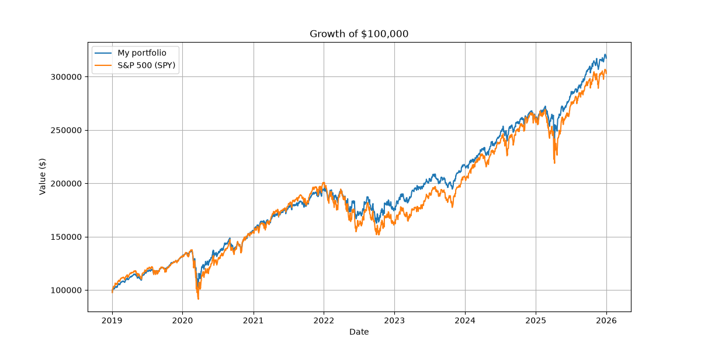
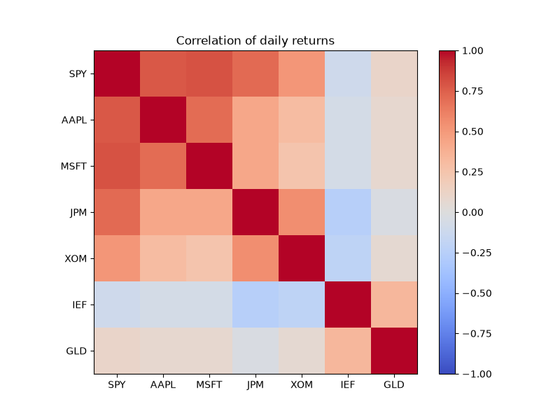

# Portfolio Risk Analysis

I made this project to learn Python and to understand how investors actually measure risk in a portfolio. It looks at a made-up $100,000 portfolio of 7 US stocks and ETFs using daily data from January 2019 to December 2025.

## The portfolio

SPY (S&P 500 ETF) 30%, Apple 10%, Microsoft 10%, JPMorgan 10%, ExxonMobil 10%, IEF (7-10 year US government bonds) 20% and GLD (gold) 10%.

I didn't want to just use equal weights, so I put most of the stock money into the S&P 500 and kept each single stock at 10% max. The 20% in bonds and 10% in gold are there to make the portfolio less risky. The weights are at the top of the notebook if you want to try different ones.

## What I did

I downloaded adjusted prices with yfinance, checked the data for missing values, and calculated daily returns. Then I compared the portfolio with the S&P 500 and worked out the annualised return, volatility, Sharpe ratio, maximum drawdown, correlation between the assets and the 1-day 95% Value at Risk. At the end I compared a few different weightings and tested what would happen if stocks suddenly fell 10%, 15% or 20%.

## Results

|  | My portfolio | S&P 500 |
|---|---|---|
| Annual return | 18.0% | 17.2% |
| Volatility | 14.9% | 19.8% |
| Sharpe ratio | 1.04 | 0.74 |

The biggest fall was -25.3% during the COVID crash in March 2020. The 95% VaR was -1.28%, so on 95% of days the portfolio lost less than about $1,283. If stocks dropped 20%, the portfolio would lose about 14%.





The most interesting thing for me was that the portfolio was less volatile than the S&P 500 even though Apple, Microsoft, JPMorgan and Exxon were all much more volatile on their own. This is because bonds and gold don't move with stocks very much (bonds were actually slightly negatively correlated with them). When I changed the weights, a stocks-only version made more money (22.4% a year) but was a lot riskier (21.3% volatility), and a conservative version was the opposite.

## Limitations

The results look better than they probably should, because I picked Apple and Microsoft already knowing they did really well. I also only tested one 7-year period, assumed the weights stay the same every day, ignored trading costs and used a fixed 2.5% risk-free rate. The VaR is based only on past data, and the stress test assumes every stock falls by the same amount while bonds and gold don't move, which isn't what happens in a real crash.

## Running it

```
pip install -r requirements.txt
```

Then open `portfolio-risk-analysis.ipynb` and run all the cells.
